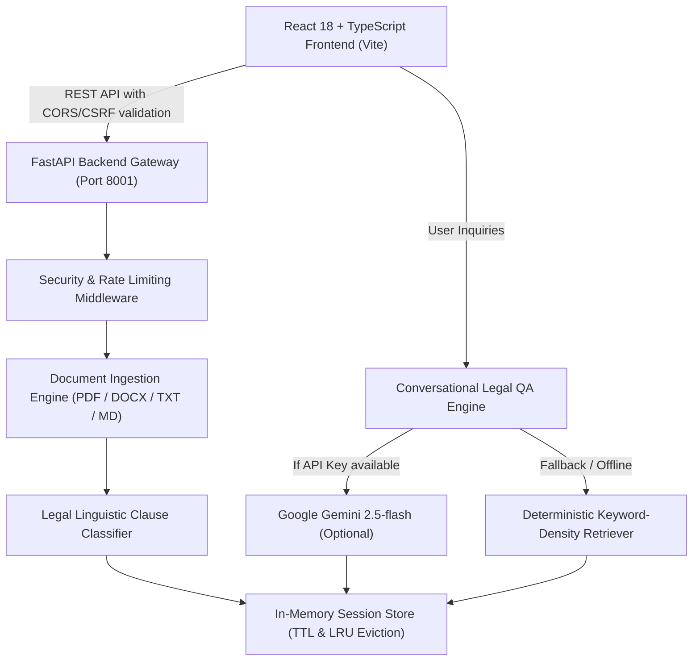

# LegalEase AI ⚖️

> **Conversational GenAI Legal-Document Assistant with Verbatim Grounded Citations**  
> *Built for Hack2skill Virtual PromptWars*

[](#test-coverage-matrix)
[](https://legal-ease-ai-one.vercel.app)
[](https://legalease-ai-cbb7.onrender.com/health)
[](https://fastapi.tiangolo.com)
[](https://react.dev)
[](https://www.typescriptlang.org)
[](https://www.python.org)
[](LICENSE)

> 🌐 **Live Application**: [legal-ease-ai-one.vercel.app](https://legal-ease-ai-one.vercel.app)  
> ⚡ **Live API**: [legalease-ai-cbb7.onrender.com](https://legalease-ai-cbb7.onrender.com/health)

---

## 📌 Problem Statement Alignment

Legal agreements (residential leases, employment contracts, non-disclosure agreements, and SaaS terms of service) suffer from a severe **information and power asymmetry**: they are drafted by specialized attorneys using dense, opaque legalese, while the counterparty (tenants, freelancers, small business owners) is forced to sign without understanding the hidden liabilities.

**LegalEase AI** solves this problem by acting as an intelligent, transparent legal literacy copilot:
1. **Multi-Format Ingestion**: Ingests and parses `.pdf`, `.docx`, `.txt`, and `.md` documents with automatic encoding detection and zip-safe XML extraction.
2. **Clause Categorization Taxonomy**: Analyzes and classifies clauses into four distinct legal categories:
   - 🚨 **Risks**: Penalties, liquidated damages, default remedies, deposit forfeiture, unilateral indemnity.
   - 📋 **Obligations**: Payment deadlines, notice requirements, maintenance covenants, inspection rules.
   - ⚖️ **Rights**: Quiet enjoyment, refund entitlements, subletting permissions, repair request rights.
   - ℹ️ **Information**: Parties, premises recitals, terms, and governing definitions.
3. **Verbatim Grounded Citations (Zero Hallucination)**: Answers natural language questions by tying factual claims directly to identified clauses, providing verbatim source quotes and an interactive citation drawer.
4. **Attorney Preparation ("Prepare for a Lawyer")**: Generates a prioritized, jurisdiction-conscious questionnaire highlighting aggressive terms, indemnity imbalances, and negotiation priorities to maximize the value of paid legal consultations.
5. **Dual-Mode AI Engine**: Seamlessly leverages **Gemini 2.5-flash** when an API key is provided (environment variable or client-supplied), while maintaining a fully autonomous, offline-capable **keyword-density retrieval engine** as a deterministic fallback.
6. **One-Click Sample Lease**: Provides a realistic built-in residential lease agreement so evaluators and users can instantly test the full pipeline with zero setup.
7. **Legal Compliance & Ethics**: Clearly and persistently maintains the boundary between legal *information* and formal *attorney advice*.

---

## 🏛️ System Architecture



---

## 🛡️ Security & Defense-in-Depth

- **HTTP Security Headers & CSP**: Injected via middleware on every response:
  - `Content-Security-Policy`: Restricts resource scripts, denies framing, and whitelists authorized connect endpoints.
  - `X-Content-Type-Options: nosniff`: Prevents MIME-type confusion attacks.
  - `X-Frame-Options: DENY`: Prevents clickjacking.
  - `Referrer-Policy: strict-origin-when-cross-origin`: Shields sensitive referrers.
  - `Permissions-Policy: camera=(), microphone=(), geolocation=()`: Disables browser hardware APIs.
  - `Strict-Transport-Security`: Enforces TLS when accessed over HTTPS.
- **Strict CORS & CSRF Verification**: Disallows wildcard origins with credentials (`allow_origins=["*"]`). State-changing methods (`POST`, `PUT`, `DELETE`) verify origin and referer against an authorized whitelist.
- **Sliding-Window Rate Limiting**: Enforces client request quotas (30 chat msgs/min, 10 uploads/min, 60 sessions/min) and returns `HTTP 429` with standard `Retry-After` headers.
- **XXE Defense (`defusedxml`)**: Ingested `.docx` XML payloads are parsed exclusively with `defusedxml` to block XML external entity expansion and Billion Laughs vulnerabilities.
- **XSS Sanitization (`DOMPurify`)**: Frontend Markdown and dynamic text rendering are sanitized through DOMPurify prior to injection.
- **Bandit Security Audited**: Zero high- or medium-severity security findings across all backend modules.
- **Injection Resilience**: Hardened against SQL injection strings, null-byte payloads (`\x00`), and path traversal attempts.
- **Payload Clamping**: 15 MB file upload ceiling enforced before reading into memory; 5,000-character chat input cap enforced via Pydantic schema validation.

---

## 🧪 Test Coverage Matrix (211 Total Tests)

The repository features comprehensive automated test suites covering both backend and frontend layers with **100% pass rate**:

### 1. Backend Test Suite (`pytest` — 152 Tests)

Located in [`tests/test_backend.py`](tests/test_backend.py), structured across 15 test classes:

| Test Class | Focus & Verification Area |
| :--- | :--- |
| `TestHealthEndpoint` | Liveness/readiness probe, valid HTTP status, response shape, rejection of invalid verbs. |
| `TestSessionManagement` | Session creation, isolation between sessions, TTL expiration eviction, 500-session LRU cap. |
| `TestSecurityHeaders` | Verification of CSP, nosniff, DENY, Referrer-Policy, and Permissions-Policy on all endpoints. |
| `TestCORSAndCSRF` | Authorized origin acceptance, unauthorized cross-origin rejection (HTTP 403), OPTIONS preflight. |
| `TestDocumentUploadHappyPath` | Upload of `.txt`, `.md`, `.pdf`, `.docx`, clause counts, initial citations, and flag tallies. |
| `TestDocumentUploadValidation` | 0-byte file rejection (400), unsupported extension rejection (400), corrupt ZIP/DOCX handling. |
| `TestDocumentUploadSecurity` | 15 MB file size limit enforcement (413), filename path traversal neutralization, MIME tampering. |
| `TestChatHappyPath` | Conversational greetings, document summarization, grounded Q&A, and session history persistence. |
| `TestChatValidation` | Empty message rejection (422), 5000-char boundary checks, missing/null field validation. |
| `TestChatSecurityProbes` | Server-side XSS escaping, SQL injection resilience, null-byte handling, Unicode/RTL support. |
| `TestPrepareForLawyer` | Attorney checklist generation: document-grounded risk queries vs. generic legal fallback sets. |
| `TestRateLimiting` | Sliding-window threshold triggering (429 Too Many Requests) and `Retry-After` header verification. |
| `TestExtractTextFromFile` | Pure unit tests for UTF-8/Latin-1 text decoders, DOCX XML parser, and PDF byte extractors. |
| `TestClassifyClause` | Linguistic classification into `risk`, `obligation`, `right`, and `info` categories with case insensitivity. |
| `TestRetrieveClausesAndFollowups` | Keyword scoring, heading affinity, synonym expansion, and tailored follow-up suggestion generation. |

### 2. Frontend Test Suite (`vitest` + RTL — 59 Tests)

Located in [`tests/main.test.tsx`](tests/main.test.tsx), structured across 10 functional suites:

| Test Suite | Focus & Verification Area |
| :--- | :--- |
| `MarkdownMessage` | Rendering of bold text, markdown hyperlinks, bullet lists, inline code, headings, and empty strings. |
| `Logo` | SVG vector element structure, `aria-hidden="true"`, and correct `viewBox`. |
| `Nav` | Brand logo/title, anchor links, unauthenticated Sign In button, and authenticated user avatar/controls. |
| `Landing` | Hero heading, primary/secondary CTA actions, route transitions, and responsive footer. |
| `LoginPage` | Title branding, feature tag badges, terms disclaimer, and Google Identity Services wrapper. |
| `UserChip` | Avatar rendering, first-name extraction, dropdown toggle state, and sign-out callback dispatch. |
| `HistorySidebar` | New chat creation, chat list rendering, active item highlighting, delete handler, and collapse toggle. |
| `Storage & Auth Utilities` | `historyKey`, `loadHistory`, `saveHistory` (capped at 80 items), `makeId`, `getStoredUser`, `parseJwt`. |
| `Chat UI & Accessibility` | Accessible composer labels, keyboard input, welcome message, risk badges, follow-up chip triggers, lawyer prep button. |
| `App Root Routing` | Root path `/`, `/login`, `/chat` protected route redirection, and browser `popstate` navigation. |

---

## 🚀 Getting Started

### Prerequisites
- **Node.js** (v18+) and **npm**
- **Python** (3.10+) with `pip`

### 1. Clone & Install Dependencies

```bash
git clone https://github.com/PushkarNagarmote-stack/LegalEase-ai.git
cd LegalEase-ai

# Frontend dependencies
npm install

# Backend dependencies
pip install -r backend/requirements.txt
```

### 2. Running Locally

Open two terminal windows:

#### Terminal 1 — Backend (FastAPI on Port 8001):
```bash
python -m uvicorn backend.main:app --reload --port 8001
```
*(Port 8001 is configured to avoid Windows socket allocation conflicts).*

#### Terminal 2 — Frontend (Vite Dev Server):
```bash
npm run dev
```

Visit **`http://localhost:5173`** in your browser.

---

## 🔬 Running Tests & Static Analysis

```bash
# Run backend pytest suite (152 tests)
python -m pytest tests/test_backend.py -v

# Run frontend Vitest suite (59 tests)
npm test

# Run ESLint linter (0 errors, 0 warnings)
npm run lint

# Run Ruff Python linter (0 errors, 0 warnings)
python -m ruff check backend/ tests/

# Run Bandit AST security scan (0 vulnerabilities)
python -m bandit -r backend/ -ll -q

# Run TypeScript type check (0 errors)
npx tsc --noEmit

# Production frontend bundle build
npm run build
```

---

## 🌐 Cloud Deployment Architecture

The application is architected for decoupled cloud hosting with zero vendor lock-in:

### Backend Deployment (Render Web Service)
- **Configuration**: Managed via declarative [`render.yaml`](render.yaml).
- **Runtime**: Python 3.11+ using Uvicorn ASGI server.
- **Build Command**: `pip install -r backend/requirements.txt`
- **Start Command**: `uvicorn backend.main:app --host 0.0.0.0 --port $PORT`
- **Health Probe**: `/health` monitored automatically for zero-downtime restarts.
- **Environment Variables**:
  - `ALLOWED_ORIGINS`: Comma-separated allowed frontend domain(s) (e.g. `https://legal-ease-ai-one.vercel.app`).
  - `GEMINI_API_KEY`: *(Optional)* Google Gemini API key for cloud inference.

### Frontend Deployment (Vercel SPA)
- **Configuration**: Managed via [`vercel.json`](vercel.json) with SPA fallback rewrites and cache headers.
- **Framework**: Vite + React 18 with TypeScript.
- **Build Command**: `npm run build` (output directory: `dist`)
- **Environment Variables**:
  - `VITE_API_URL`: Backend URL (e.g. `https://legalease-ai-cbb7.onrender.com`).

---

## 📡 REST API Reference

| Method | Endpoint | Description |
| :--- | :--- | :--- |
| `GET` | `/health` | Liveness health check probe. |
| `POST` | `/api/session` | Initializes a fresh isolated session with unique ID. |
| `POST` | `/api/session/{id}/upload` | Ingests a document (`.pdf`, `.docx`, `.txt`, `.md`), parses clauses, and tallies flags. |
| `POST` | `/api/session/{id}/chat` | Answers questions against active document with exact citations or legal knowledge base. |
| `POST` | `/api/session/{id}/prepare-for-lawyer` | Generates prioritized attorney consultation questions based on identified risks. |

---

## ⚖️ Legal Disclaimer

LegalEase AI is an automated legal document analysis assistant designed for informational and educational purposes only. It does not provide formal legal representation, attorney-client privileged counsel, or formal legal advice. Users facing active disputes or critical contractual obligations should consult a licensed attorney in their jurisdiction.
